# VRC Stocking Generator Manual

VRC Stocking Generator is a Unity editor extension for creating stockings from an avatar body. It can create knee-high stockings, pantyhose, full body tights, arm stockings, and custom cut shapes using exclusion colliders.

Installing Modular Avatar and lilToon is recommended. If Modular Avatar is not installed, Blendshape Sync and Merge Armature are not configured. If lilToon is not installed, the materials used by the presets cannot be loaded.

## Basic Usage {#basic-usage}

1. Open the tool from `Tools > Stocking Generator`.
2. Assign the avatar body's `Skinned Mesh Renderer` to `Body > Skinned Mesh Renderer`.
3. Choose a preset or assign your own material in the `Material` section.
4. Click `Generate Stocking`.
5. A stocking is generated. Adjust colors or mask settings as needed, then generate again until the result looks right.

The generated stocking object is created next to the source body object in the hierarchy. Meshes, textures, materials, and prefabs are saved to the selected output folder.

## Examples {#examples}

- Knee-high stockings

??? note "How to make this"

    Set `Mask Mode` to `KneeHigh`, then adjust `Stocking Height Offset` as needed.

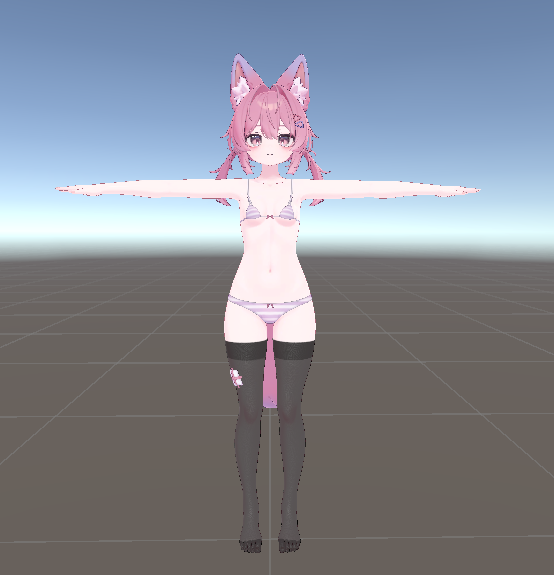

- Pantyhose

??? note "How to make this"

    Set `Mask Mode` to `Pantyhose`, then adjust `Stocking Height Offset` as needed. If underwear clips through the stocking, slightly increase `Output > Advanced Settings > Normal Offset`.

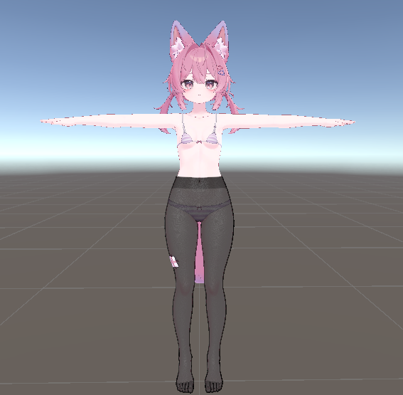

- Arm stockings

??? note "How to make this"

    Enable `Arm Stocking`, then adjust `Arm Length Offset` as needed.

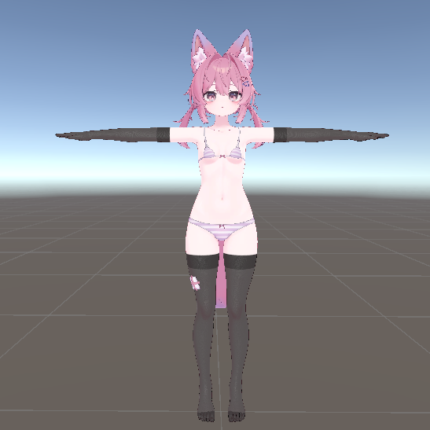

- Full body tights

??? note "How to make this"

    Enable `Full body tights`, then use `Neck Mask` if you want to cut the mask around the neck. When knee-high, pantyhose, or arm stocking boundaries are enabled, the boundary areas are darkened.

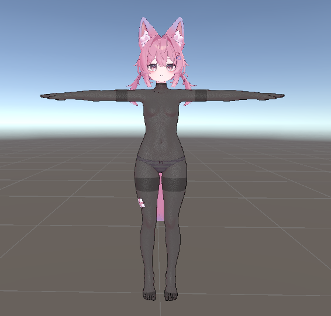

- Asymmetric or single-side knee-high / arm stockings

??? note "How to make this"

    Enable `Separate left/right height offsets`, then adjust each side. To generate only one side, disable the side you do not want with `Right KneeHigh`, `Left KneeHigh`, `Right Arm Stocking`, or `Left Arm Stocking`.

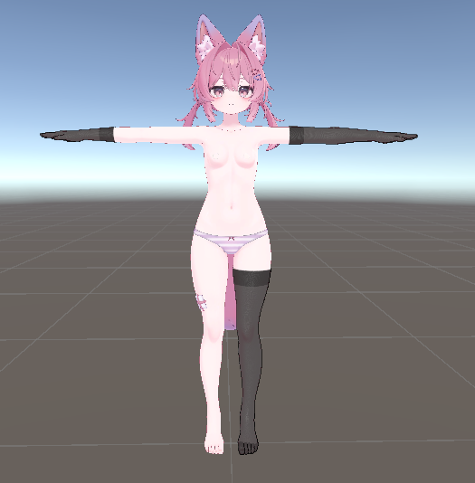

- Sleeveless tights

??? note "How to make this"

    Use [Exclusion Colliders](#advanced-exclusion-colliders).

    Enable `Full body tights`, then enable `Neck Mask`. Add an empty GameObject to the hierarchy, then add several empty GameObjects under it. Add sphere, capsule, and box collider components to the child objects.

    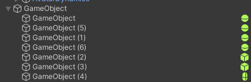
    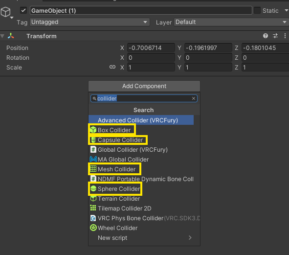

    Cover the arms with sphere colliders, the sides with capsule colliders, and the back with a box collider to create a clean sleeveless shape. Adjust collider position and size until the arm openings match the shape you want.

    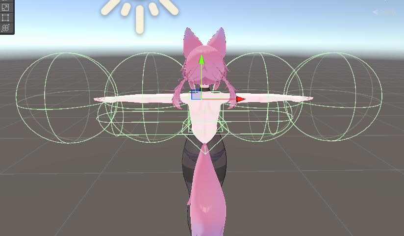
    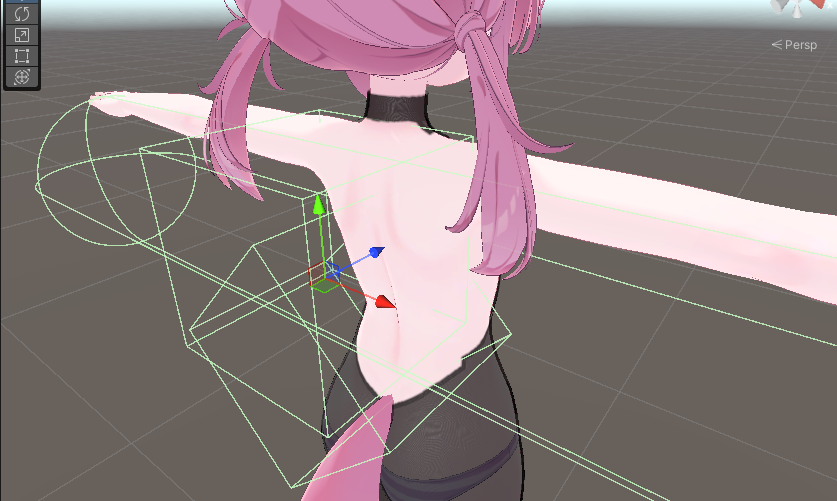

    Enable `Exclusion Colliders`, assign the root object of the colliders to `Root`, and adjust `Dark Length` to control the dark edge around the arm openings.

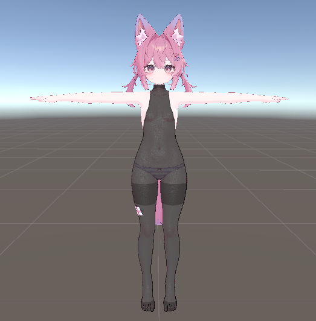
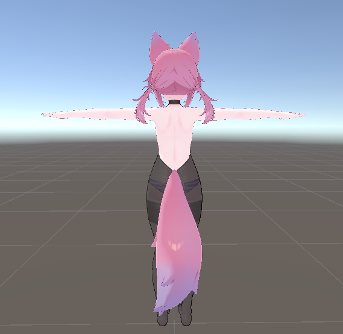

- Cut out the heel and toes

??? note "How to make this"

    Use [Exclusion Colliders](#advanced-exclusion-colliders).

    Add a GameObject to the hierarchy, then add child objects with capsule colliders. Place the capsule colliders side by side.

    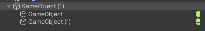
    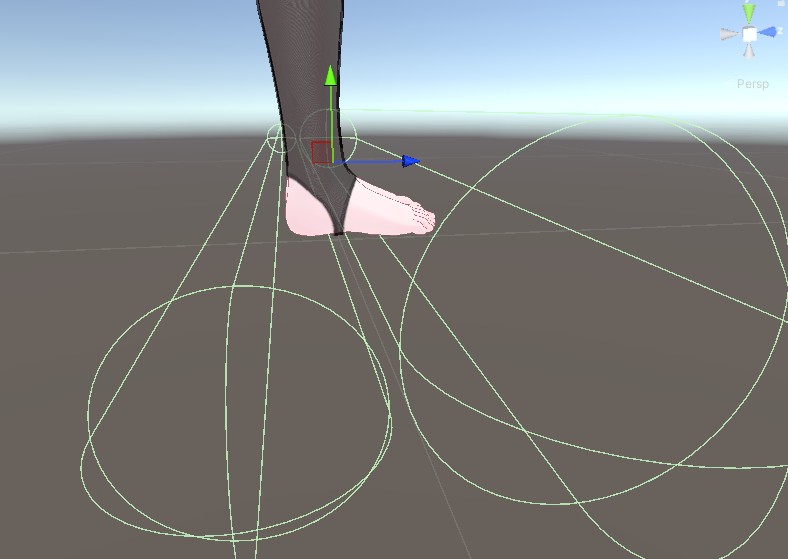

    Enable `Exclusion Colliders`, assign the root object of the colliders to `Root`, and adjust `Dark Length` to control the dark edge around the heel and toe cuts.

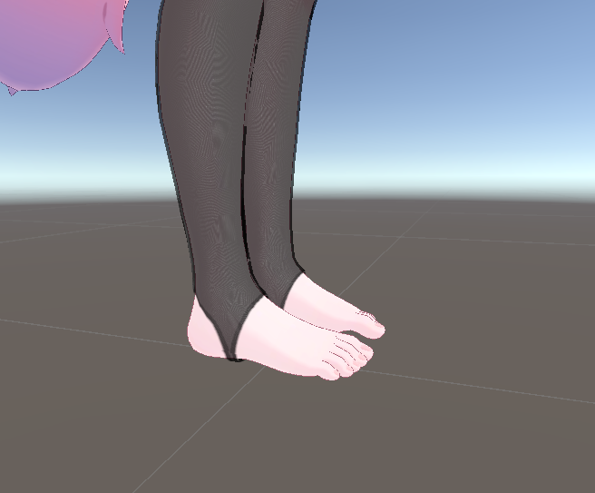

- Torn tights

??? note "How to make this"

    Use [Exclusion Colliders](#advanced-exclusion-colliders).

    Add `Assets/ranhai613/StockingGenerator/Colliders/ripping_mold.prefab` to the hierarchy. It contains multiple mesh colliders as child objects. Move and resize them to create the torn shape. Be careful when mesh colliders are too close to each other, because the removed areas may connect.

    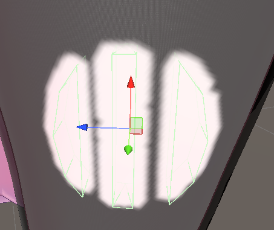

    Enable `Exclusion Colliders`, assign the root object of the colliders to `Root`, and set `Dark Length` to 0. If you are also using dark edges for other cutout areas, enable `2nd Root`, assign the root for the torn tights, and set `2nd Dark Length` to 0.

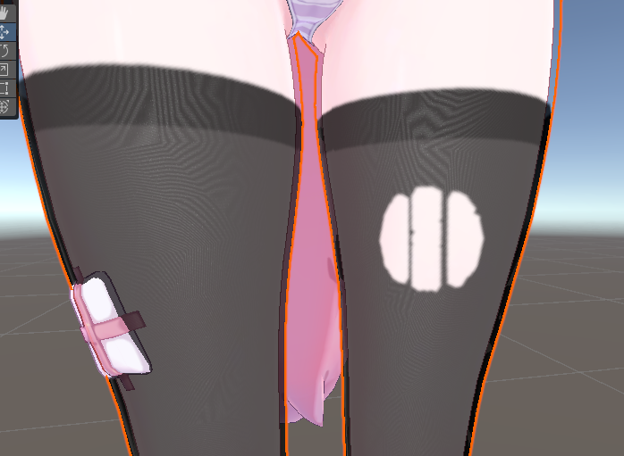

## Changing Colors {#color-settings}

Stocking colors can be changed in the `Stocking Color` section. `Normal Color` is the base stocking color, and `Dark Color` is used for darker areas such as boundaries and toes. When you select `Material > Preset`, these colors are also updated to match the preset.

### Color Preset Examples {#color-presets}

- White

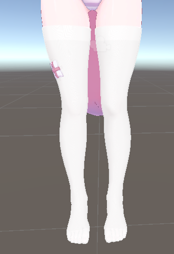

- Navy

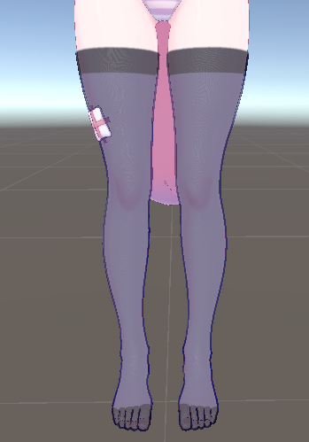

- Wine red

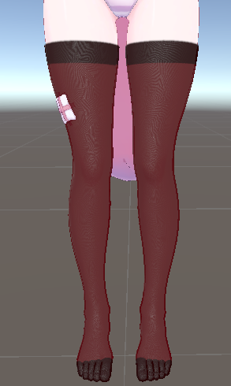

## Using Your Own Material {#custom-material}

Select `Custom` in the `Material` section to assign your own material for stocking generation. When the stocking is generated, the selected material is copied, then the generated main color texture and alpha mask texture are assigned to the copy. The original material is not modified.

### Using Other Shaders {#custom-shader}

lilToon is supported by default. Other shaders, such as Poiyomi, may also work, but full compatibility is not guaranteed because texture assignment differs by shader. If automatic assignment fails, manually assign the generated texture and alpha mask to the copied material. By default, generated textures are saved under `Assets/ranhai613/StockingGenerator/Generated`.

## Limitations {#limitations}

- Rigs other than Humanoid bones are not guaranteed to work.
- Stocking boundaries may look rough when viewed up close. Increasing `Material > Advanced Settings > Main Color Texture Size` or `Stocking Alpha Mask > Advanced Settings > Mask Texture Size` may improve the result.
- Because the body mesh is used directly, feet may look like five-toe socks.
- Sharp mesh parts such as nails may fail to connect cleanly. Nail meshes may also overlap and make the color look unnaturally dark.

## Field Reference {#field-reference}

<table>
  <thead>
    <tr>
      <th>Field</th>
      <th>Description</th>
    </tr>
  </thead>
  <tbody>
    <tr>
      <td><code>UI Language</code></td>
      <td>Selects the editor UI language.</td>
    </tr>
    <tr>
      <td><code>Body</code></td>
      <td>
        Sets the source body used for stocking mesh and mask generation. The source renderer must have a valid mesh.
        <table>
          <thead>
            <tr>
              <th>Parameter</th>
              <th>Description</th>
            </tr>
          </thead>
          <tbody>
            <tr>
              <td><code>Skinned Mesh Renderer</code></td>
              <td>The source body renderer. Rigs other than Humanoid bones are not guaranteed to work. This field is required.</td>
            </tr>
          </tbody>
        </table>
      </td>
    </tr>
    <tr>
      <td><code>Material</code></td>
      <td>
        Configures the material used for the generated stocking and the generated main color texture.
        <table>
          <thead>
            <tr>
              <th>Parameter</th>
              <th>Description</th>
            </tr>
          </thead>
          <tbody>
            <tr>
              <td><code>Preset</code></td>
              <td>Selects a color preset. Available presets are <code>Custom</code>, <code>Black</code>, <code>Brown</code>, <code>White</code>, <code>Navy</code>, and <code>Wine</code>.</td>
            </tr>
            <tr>
              <td><code>Material</code></td>
              <td>The source material copied for the generated stocking. This field is required unless the preset successfully loads the default material.</td>
            </tr>
            <tr>
              <td><code>Advanced Settings</code></td>
              <td>
                <table>
                  <thead>
                    <tr>
                      <th>Parameter</th>
                      <th>Description</th>
                    </tr>
                  </thead>
                  <tbody>
                    <tr>
                      <td><code>Main Color Texture Size</code></td>
                      <td>Resolution of the generated main color texture. Higher values give more detail but create larger files.</td>
                    </tr>
                  </tbody>
                </table>
              </td>
            </tr>
          </tbody>
        </table>
      </td>
    </tr>
    <tr>
      <td><code>Stocking Color</code></td>
      <td>
        Adjusts the base stocking color and darker details around boundaries and toes.
        <table>
          <thead>
            <tr>
              <th>Parameter</th>
              <th>Description</th>
            </tr>
          </thead>
          <tbody>
            <tr>
              <td><code>Normal Color</code></td>
              <td>Base color of the generated stocking texture.</td>
            </tr>
            <tr>
              <td><code>Dark Color</code></td>
              <td>Color used for boundary darkening, toe darkening, neck boundary darkening, and exclusion collider boundary darkening.</td>
            </tr>
            <tr>
              <td><code>Darken boundary fabric</code></td>
              <td>Adds a darker band around stocking boundaries.</td>
            </tr>
            <tr>
              <td><code>Boundary Dark Width</code></td>
              <td>Width of the darker boundary band. Shown when <code>Darken boundary fabric</code> is enabled.</td>
            </tr>
            <tr>
              <td><code>Darken Toe</code></td>
              <td>Adds darker color near the toe area.</td>
            </tr>
            <tr>
              <td><code>Toe Dark Offset</code></td>
              <td>Moves the toe darkening region forward or backward along the foot direction. Shown when <code>Darken Toe</code> is enabled.</td>
            </tr>
          </tbody>
        </table>
      </td>
    </tr>
    <tr>
      <td><code>Stocking Alpha Mask</code></td>
      <td>
        Configures the alpha mask that controls where the stocking is visible.
        <table>
          <thead>
            <tr>
              <th>Parameter</th>
              <th>Description</th>
            </tr>
          </thead>
          <tbody>
            <tr>
              <td><code>Full body tights</code></td>
              <td>Generates a full body tights-style mask instead of the usual lower body stocking mask.</td>
            </tr>
            <tr>
              <td><code>Neck Mask</code></td>
              <td>
                Shown when <code>Full body tights</code> is enabled. Cuts the mask around the neck.
                <table>
                  <thead>
                    <tr>
                      <th>Parameter</th>
                      <th>Description</th>
                    </tr>
                  </thead>
                  <tbody>
                    <tr>
                      <td><code>Enable</code></td>
                      <td>Enables neck exclusion for full body tights.</td>
                    </tr>
                    <tr>
                      <td><code>Height Offset</code></td>
                      <td>Adjusts the neck cut height.</td>
                    </tr>
                    <tr>
                      <td><code>Dark Length</code></td>
                      <td>Adds a darker boundary band around the neck cut.</td>
                    </tr>
                  </tbody>
                </table>
              </td>
            </tr>
            <tr>
              <td><code>Mask Mode</code></td>
              <td><code>Naked</code> creates no leg stocking region. <code>KneeHigh</code> creates knee-high masks. <code>Pantyhose</code> creates a pantyhose-style lower body mask.</td>
            </tr>
            <tr>
              <td><code>Exclude Foot</code></td>
              <td>Removes the foot area from the generated mask.</td>
            </tr>
            <tr>
              <td><code>Foot Boundary Offset</code></td>
              <td>Adjusts the foot exclusion boundary. Shown when <code>Exclude Foot</code> is enabled.</td>
            </tr>
            <tr>
              <td><code>Left KneeHigh</code> / <code>Right KneeHigh</code></td>
              <td>Enables or disables knee-high generation for each side. Shown when <code>Mask Mode</code> is <code>KneeHigh</code>.</td>
            </tr>
            <tr>
              <td><code>Separate left/right height offsets</code></td>
              <td>
                Uses separate height offsets for the left and right sides.
                <table>
                  <thead>
                    <tr>
                      <th>Parameter</th>
                      <th>Description</th>
                    </tr>
                  </thead>
                  <tbody>
                    <tr>
                      <td><code>Left Stocking Height Offset</code></td>
                      <td>Height offset for the left knee-high stocking.</td>
                    </tr>
                    <tr>
                      <td><code>Right Stocking Height Offset</code></td>
                      <td>Height offset for the right knee-high stocking.</td>
                    </tr>
                    <tr>
                      <td><code>Stocking Height Offset</code></td>
                      <td>Shared height offset used when left and right offsets are not separated.</td>
                    </tr>
                  </tbody>
                </table>
              </td>
            </tr>
            <tr>
              <td><code>Arm Stocking</code></td>
              <td>
                Adds arm stocking regions.
                <table>
                  <thead>
                    <tr>
                      <th>Parameter</th>
                      <th>Description</th>
                    </tr>
                  </thead>
                  <tbody>
                    <tr>
                      <td><code>Enable</code></td>
                      <td>Adds arm stocking regions to the mask.</td>
                    </tr>
                    <tr>
                      <td><code>Left Arm Stocking</code> / <code>Right Arm Stocking</code></td>
                      <td>Enables or disables arm stockings for each side.</td>
                    </tr>
                    <tr>
                      <td><code>Separate left/right arm offsets</code></td>
                      <td>Uses separate length offsets for the left and right arms.</td>
                    </tr>
                    <tr>
                      <td><code>Left Arm Length Offset</code> / <code>Right Arm Length Offset</code></td>
                      <td>Length offsets for the left and right arm stockings.</td>
                    </tr>
                    <tr>
                      <td><code>Arm Length Offset</code></td>
                      <td>Shared arm stocking length offset used when left and right offsets are not separated.</td>
                    </tr>
                  </tbody>
                </table>
              </td>
            </tr>
            <tr>
              <td><code>Exclusion Colliders</code></td>
              <td>
                Uses colliders under a selected root object to remove areas from the generated alpha mask.
                <table>
                  <thead>
                    <tr>
                      <th>Parameter</th>
                      <th>Description</th>
                    </tr>
                  </thead>
                  <tbody>
                    <tr>
                      <td><code>Enable</code></td>
                      <td>Enables exclusion collider processing.</td>
                    </tr>
                    <tr>
                      <td><code>Root</code></td>
                      <td>The transform that contains the colliders used for exclusion. Enabled colliders under this root are detected recursively.</td>
                    </tr>
                    <tr>
                      <td><code>Dark Length</code></td>
                      <td>Width of the dark boundary painted around the excluded collider area in the generated main color texture.</td>
                    </tr>
                    <tr>
                      <td><code>2nd Root</code></td>
                      <td>Enables a second collider root. Use this when another collider group needs a different dark boundary width.</td>
                    </tr>
                    <tr>
                      <td><code>2nd Dark Length</code></td>
                      <td>Dark boundary width for the second collider group.</td>
                    </tr>
                  </tbody>
                </table>
              </td>
            </tr>
            <tr>
              <td><code>Advanced Settings</code></td>
              <td>
                <table>
                  <thead>
                    <tr>
                      <th>Parameter</th>
                      <th>Description</th>
                    </tr>
                  </thead>
                  <tbody>
                    <tr>
                      <td><code>Mask Texture Size</code></td>
                      <td>Resolution of the generated alpha mask texture.</td>
                    </tr>
                    <tr>
                      <td><code>Mask Padding Pixels</code></td>
                      <td>Expands generated mask edges by the specified number of pixels to reduce seams.</td>
                    </tr>
                  </tbody>
                </table>
              </td>
            </tr>
          </tbody>
        </table>
      </td>
    </tr>
    <tr>
      <td><code>Output</code></td>
      <td>
        Configures the generated object name, output location, mesh processing, and export options.
        <table>
          <thead>
            <tr>
              <th>Parameter</th>
              <th>Description</th>
            </tr>
          </thead>
          <tbody>
            <tr>
              <td><code>Object Suffix</code></td>
              <td>Suffix added to the generated stocking object name.</td>
            </tr>
            <tr>
              <td><code>Output Folder</code></td>
              <td>Folder where generated assets are saved.</td>
            </tr>
            <tr>
              <td><code>Delete previous generated stockings in hierarchy</code></td>
              <td>Deletes previously generated stocking objects with the same base name before creating a new one.</td>
            </tr>
            <tr>
              <td><code>Advanced Settings</code></td>
              <td>
                <table>
                  <thead>
                    <tr>
                      <th>Parameter</th>
                      <th>Description</th>
                    </tr>
                  </thead>
                  <tbody>
                    <tr>
                      <td><code>Normal Offset</code></td>
                      <td>Pushes the generated stocking mesh outward along normals to reduce clipping.</td>
                    </tr>
                    <tr>
                      <td><code>Smooth Iterations</code></td>
                      <td>Number of smoothing passes applied to the generated mesh.</td>
                    </tr>
                    <tr>
                      <td><code>Smooth Strength</code></td>
                      <td>Strength of mesh smoothing.</td>
                    </tr>
                    <tr>
                      <td><code>Apply Smooth Iterations to each BlendShape frame (slow)</code></td>
                      <td>Applies smoothing to blend shape frames as well as the base mesh. This can improve deformation consistency but is slower.</td>
                    </tr>
                    <tr>
                      <td><code>Export FBX if Unity FBX Exporter is installed</code></td>
                      <td>Exports an FBX when Unity FBX Exporter is available.</td>
                    </tr>
                  </tbody>
                </table>
              </td>
            </tr>
            <tr>
              <td><code>Delete Unused Generated Assets</code></td>
              <td>Deletes generated assets in the output folder that are no longer referenced by current generated stockings.</td>
            </tr>
            <tr>
              <td><code>Generate Stocking</code></td>
              <td>Creates the stocking object and generated assets.</td>
            </tr>
          </tbody>
        </table>
      </td>
    </tr>
  </tbody>
</table>

## Advanced Usage: Exclusion Colliders {#advanced-exclusion-colliders}

Exclusion Colliders remove fabric inside the specified collider volumes. They are useful when the automatic mask includes areas you want to remove, or when you need clean custom cuts around complex shapes. Enable Gizmos in the upper-right of the Scene view to see colliders while editing.

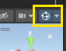

### Basic Workflow {#exclusion-colliders-workflow}

1. Create an empty GameObject near the avatar.
2. Add empty GameObjects under it, add collider components to those child objects, and place the colliders so they cover the areas to remove.

3. Enable `Exclusion Colliders` in the tool.
4. Assign the parent object to `Root`.

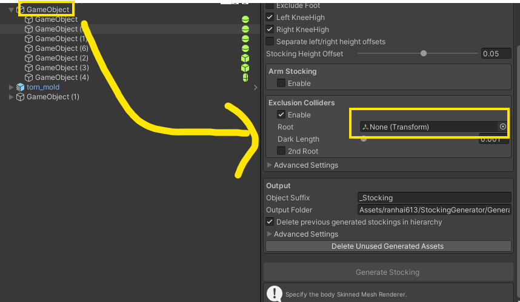

5. Adjust `Dark Length` to control the dark fabric edge around the removed area.
6. Generate the stocking and check the result.

Only enabled colliders on active GameObjects are used. Target colliders are collected from the root and its children.

### Using 2nd Root {#second-root}

Use `2nd Root` when one collider group and another collider group need different dark boundary widths. For example:

- Root: use the normal `Dark Length` for large exclusion areas.
- 2nd Root: use a `Dark Length` of 0 for holes, torn fabric, or similar cutout areas.

Both roots remove pixels from the alpha mask. Their dark boundary widths are applied separately to the generated main color texture.

### Tips {#tips}

- Use simple collider shapes where possible. They are easier to adjust and preview.
- For mesh colliders, enabling `Convex` may simplify the collider shape and change the removed area.
- Increasing the texture size makes exclusion collider edges more accurate.
- If nothing changes, confirm the collider GameObject is active and the Collider component is enabled.

## Q&A {#qa}

### Stocking generation takes too long. {#qa-slow-generation}

Possible causes include large texture sizes, high smoothing iteration counts, or enabling `Apply Smooth Iterations to each BlendShape frame (slow)`. Lowering these settings will shorten generation time. When adjusting the result, it is also recommended to reduce texture sizes to something like 1024, then increase them only for the final output.

- Reduce `Material > Advanced Settings > Main Color Texture Size` and `Stocking Alpha Mask > Advanced Settings > Mask Texture Size`.
- Reduce `Output > Advanced Settings > Smooth Iterations`.
- Disable `Output > Advanced Settings > Apply Smooth Iterations to each BlendShape frame (slow)`.

### The Generate Stocking button is disabled. What should I check? {#qa-generate-disabled}

Make sure `Skinned Mesh Renderer` is assigned, the renderer has a mesh, and a valid material is assigned.

### The generated mask is empty or missing. Why? {#qa-empty-mask}

The source mesh may not have UV0, the expected bones may not be found, or the selected `Mask Mode` may not match the avatar rig. Try another `Mask Mode`, confirm the mesh has UVs, and check the Console for `StockingGenerator` warnings.

### Underwear clips through the body. What should I do? {#qa-clipping}

Slightly increase `Normal Offset`.

### Why are BlendShapes not matching perfectly? {#qa-blendshape}

Enable `Apply Smooth Iterations to each BlendShape frame (slow)` when using smoothing. This takes longer but can make blend shape deformation more consistent.

### How do I make only arm stockings? {#qa-arm-only}

Set `Mask Mode` to `Naked`, enable `Arm Stocking`, then enable the left and/or right arm options.

### How do I make pantyhose or full body tights? {#qa-pantyhose-fullbody}

Use `Mask Mode > Pantyhose` for lower body pantyhose. Enable `Full body tights` for a full body style, then optionally enable `Neck Mask` to cut around the neck.

### The foot area should be bare. Which option should I use? {#qa-bare-foot}

Enable `Exclude Foot`, then adjust `Foot Boundary Offset` until the cut is in the desired position.

### Exclusion Colliders do not affect the result. What should I check? {#qa-exclusion-colliders}

Confirm `Exclusion Colliders` is enabled, `Root` is assigned, the collider GameObjects are active, and each Collider component is enabled. Also make sure the colliders actually overlap the body mesh area you want to remove.

### When should I use 2nd Root? {#qa-second-root}

Use it when you need two collider groups with different dark boundary widths. If both groups can share the same dark edge width, one root is enough.

### Where are generated assets saved? {#qa-output-folder}

They are saved in `Output Folder`. By default, this is `Assets/ranhai613/StockingGenerator/Generated`.
