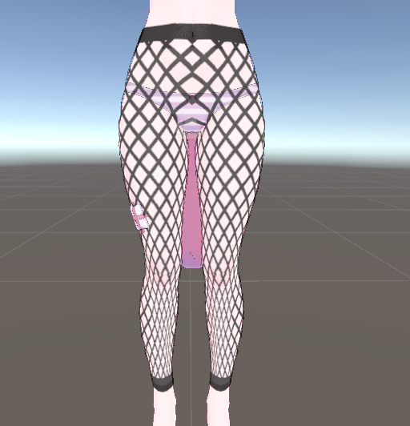

# VRC Stocking Generator 手册

VRC Stocking Generator 是一个 Unity 编辑器扩展，可以从头像身体生成丝袜。它可以制作过膝袜、连裤袜、连体裤袜、手臂丝袜，也可以使用排除碰撞体制作自定义裁剪形状。

建议安装 Modular Avatar 和 lilToon。如果未安装 Modular Avatar，将不会配置 Blendshape Sync 和 Merge Armature。如果未安装 lilToon，将无法加载预设使用的材质。

## 基本使用方法 {#basic-usage}

1. 从 `工具（Tools） > Stocking Generator（丝袜生成器）` 打开工具。
2. 在 `身体 > Skinned Mesh Renderer` 中指定头像身体的 `Skinned Mesh Renderer`。
3. 在 `材质` 中选择预设，或指定自己的材质。
4. 点击 `生成丝袜`。
5. 丝袜会被生成。根据需要调整颜色或遮罩设置，然后再次生成，直到效果合适。

生成的丝袜对象会创建在源身体对象旁边。网格、贴图、材质和 prefab 会保存到指定的输出文件夹。

## 制作示例 {#examples}

- 过膝袜

??? note "制作方法"

    将 `遮罩模式` 设置为 `过膝袜`，然后根据需要调整 `丝袜高度偏移`。

- 连裤袜

??? note "制作方法"

    将 `遮罩模式` 设置为 `连裤袜`，然后根据需要调整 `丝袜高度偏移`。如果内衣穿进丝袜，请稍微增大 `输出 > 高级设置 > 法线偏移`。

- 手臂丝袜

??? note "制作方法"

    启用 `手臂丝袜`，然后根据需要调整 `手臂长度偏移`。

- 连体裤袜

??? note "制作方法"

    启用 `连体裤袜`。如果想在颈部周围裁剪遮罩，请使用 `颈部遮罩`。启用过膝袜、连裤袜或手臂丝袜边界时，边界区域会被加深。

- 左右高度不同，或只生成单侧过膝袜/手臂丝袜

??? note "制作方法"

    启用 `分开左右高度偏移`，然后分别调整左右两侧。如果只想生成单侧，请关闭不需要的一侧，例如 `右侧过膝袜`、`左侧过膝袜`、`右臂丝袜` 或 `左臂丝袜`。

- 渔网袜

??? note "制作方法"

    启用 `渔网图案`，然后根据需要调整 `网格尺寸`、`网线宽度` 和 `圆周方向网格数`。

- 无袖连体裤袜

??? note "制作方法"

    使用 [排除碰撞体](#advanced-exclusion-colliders)。

    启用 `连体裤袜`，然后启用 `颈部遮罩`。在层级中添加一个空 GameObject，并在其下方添加几个空 GameObject。向子对象添加球体、胶囊和盒形碰撞体组件。

    
    

    用球体碰撞体覆盖手臂，用胶囊碰撞体覆盖侧面，用盒形碰撞体覆盖背部，可以制作干净的无袖形状。调整碰撞体的位置和大小，直到袖口符合想要的形状。

    
    

    启用 `排除碰撞体`，将碰撞体的根对象指定到 `根对象`，并调整 `加深长度` 来控制袖口周围的深色边缘。

- 裁掉脚跟和脚尖

??? note "制作方法"

    使用 [排除碰撞体](#advanced-exclusion-colliders)。

    在层级中添加一个 GameObject，并在子对象中添加胶囊碰撞体。将胶囊碰撞体横向排列。

    
    

    启用 `排除碰撞体`，将碰撞体的根对象指定到 `根对象`，并调整 `加深长度` 来控制脚跟和脚尖裁剪边缘的深色宽度。

- 破损连裤袜

??? note "制作方法"

    使用 [排除碰撞体](#advanced-exclusion-colliders)。

    将 `Assets/ranhai613/StockingGenerator/Colliders/ripping_mold.prefab` 添加到层级中。它的子对象中包含多个 mesh collider。移动并缩放它们来制作破损形状。mesh collider 彼此太近时，移除区域可能会连接在一起，请注意。

    

    启用 `排除碰撞体`，将碰撞体的根对象指定到 `根对象`，并将 `加深长度` 设为 0。如果其他裁剪区域也需要深色边缘，请启用 `第二个根对象`，指定破损连裤袜用的根对象，并将 `第二个加深长度` 设为 0。

## 更改颜色 {#color-settings}

丝袜颜色可以在 `丝袜颜色` 中更改。`普通颜色` 是丝袜的基础颜色，`深色` 用于边界和脚尖等较深的区域。选择 `材质 > 预设` 时，这些颜色也会根据预设更新。

### 颜色示例（预设） {#color-presets}

- 白色

- 藏青色

- 酒红色

## 使用自己的材质 {#custom-material}

在 `材质` 中选择 `自定义` 后，可以指定用于生成丝袜的材质。生成丝袜时，指定的材质会被复制，并将主颜色贴图和 Alpha 遮罩贴图替换到复制后的材质上。原始材质不会被修改。

### 使用其他着色器 {#custom-shader}

默认支持 lilToon。其他着色器（例如 Poiyomi）也可能可以使用，但不同着色器的贴图替换方式可能不同，因此不能保证完全兼容。如果自动替换失败，请手动为复制后的材质指定生成的贴图和 Alpha 遮罩。默认情况下，生成的贴图会保存到 `Assets/ranhai613/StockingGenerator/Generated`。

## 限制 {#limitations}

- 不保证 Humanoid 以外骨骼的动作。
- 近距离观察时，丝袜边界可能看起来比较粗糙。增大 `材质 > 高级设置 > 主颜色贴图尺寸` 或 `丝袜 Alpha 遮罩 > 高级设置 > 遮罩贴图尺寸` 可能会改善结果。
- 因为直接使用身体网格，脚部可能看起来像“五趾袜”。
- 指甲等尖锐网格部分可能无法干净连接，导致网格破损。指甲网格重叠时，颜色也可能异常变深。

## 各项目说明 {#field-reference}

<table>
  <thead>
    <tr>
      <th>项目</th>
      <th>说明</th>
    </tr>
  </thead>
  <tbody>
    <tr>
      <td><code>界面语言</code></td>
      <td>选择编辑器 UI 语言。</td>
    </tr>
    <tr>
      <td><code>身体</code></td>
      <td>
        设置用于生成丝袜网格和遮罩的源身体。源渲染器必须有有效的网格。
        <table>
          <thead>
            <tr>
              <th>参数</th>
              <th>说明</th>
            </tr>
          </thead>
          <tbody>
            <tr>
              <td><code>Skinned Mesh Renderer</code></td>
              <td>源身体渲染器。不保证 Humanoid 以外骨骼的动作。此项必填。</td>
            </tr>
          </tbody>
        </table>
      </td>
    </tr>
    <tr>
      <td><code>材质</code></td>
      <td>
        设置生成丝袜使用的材质，以及生成主颜色贴图的相关设置。
        <table>
          <thead>
            <tr>
              <th>参数</th>
              <th>说明</th>
            </tr>
          </thead>
          <tbody>
            <tr>
              <td><code>预设</code></td>
              <td>选择颜色预设。可用预设包括 <code>自定义</code>、<code>黑色</code>、<code>棕色</code>、<code>白色</code>、<code>藏青色</code> 和 <code>酒红色</code>。</td>
            </tr>
            <tr>
              <td><code>材质</code></td>
              <td>复制后用于生成丝袜的源材质。如果预设无法成功加载默认材质，则此项必填。</td>
            </tr>
            <tr>
              <td><code>高级设置</code></td>
              <td>
                <table>
                  <thead>
                    <tr>
                      <th>参数</th>
                      <th>说明</th>
                    </tr>
                  </thead>
                  <tbody>
                    <tr>
                      <td><code>主颜色贴图尺寸</code></td>
                      <td>生成的主颜色贴图分辨率。数值越大细节越多，但文件也会更大。</td>
                    </tr>
                  </tbody>
                </table>
              </td>
            </tr>
          </tbody>
        </table>
      </td>
    </tr>
    <tr>
      <td><code>丝袜颜色</code></td>
      <td>
        调整丝袜的基础颜色，以及边界和脚尖等位置的深色表现。
        <table>
          <thead>
            <tr>
              <th>参数</th>
              <th>说明</th>
            </tr>
          </thead>
          <tbody>
            <tr>
              <td><code>普通颜色</code></td>
              <td>生成丝袜贴图的基础颜色。</td>
            </tr>
            <tr>
              <td><code>深色</code></td>
              <td>用于边界加深、脚尖加深、颈部边界加深和排除碰撞体边界加深的颜色。</td>
            </tr>
            <tr>
              <td><code>加深边界织物</code></td>
              <td>在丝袜边界附近添加深色带。</td>
            </tr>
            <tr>
              <td><code>边界加深宽度</code></td>
              <td>深色边界带的宽度。启用 <code>加深边界织物</code> 时显示。</td>
            </tr>
            <tr>
              <td><code>加深脚尖</code></td>
              <td>在脚尖附近添加深色。</td>
            </tr>
            <tr>
              <td><code>脚尖加深偏移</code></td>
              <td>沿脚部方向前后移动脚尖加深区域。启用 <code>加深脚尖</code> 时显示。</td>
            </tr>
          </tbody>
        </table>
      </td>
    </tr>
    <tr>
      <td><code>丝袜 Alpha 遮罩</code></td>
      <td>
        设置控制丝袜显示区域的 Alpha 遮罩。
        <table>
          <thead>
            <tr>
              <th>参数</th>
              <th>说明</th>
            </tr>
          </thead>
          <tbody>
            <tr>
              <td><code>连体裤袜</code></td>
              <td>生成连体裤袜风格的遮罩，而不是通常的下半身丝袜遮罩。</td>
            </tr>
            <tr>
              <td><code>颈部遮罩</code></td>
              <td>
                启用 <code>连体裤袜</code> 时显示。用于在颈部周围裁剪遮罩。
                <table>
                  <thead>
                    <tr>
                      <th>参数</th>
                      <th>说明</th>
                    </tr>
                  </thead>
                  <tbody>
                    <tr>
                      <td><code>启用</code></td>
                      <td>为连体裤袜启用颈部排除。</td>
                    </tr>
                    <tr>
                      <td><code>高度偏移</code></td>
                      <td>调整颈部裁剪高度。</td>
                    </tr>
                    <tr>
                      <td><code>加深长度</code></td>
                      <td>在颈部裁剪边界周围添加深色边界带。</td>
                    </tr>
                  </tbody>
                </table>
              </td>
            </tr>
            <tr>
              <td><code>遮罩模式</code></td>
              <td><code>无</code> 不生成腿部丝袜区域。<code>过膝袜</code> 生成过膝袜遮罩。<code>连裤袜</code> 生成下半身连裤袜风格遮罩。</td>
            </tr>
            <tr>
              <td><code>排除脚部</code></td>
              <td>从生成的遮罩中移除脚部区域。</td>
            </tr>
            <tr>
              <td><code>脚部边界偏移</code></td>
              <td>调整脚部排除边界。启用 <code>排除脚部</code> 时显示。</td>
            </tr>
            <tr>
              <td><code>左侧过膝袜</code> / <code>右侧过膝袜</code></td>
              <td>分别启用或禁用左右两侧的过膝袜生成。<code>遮罩模式</code> 为 <code>过膝袜</code> 时显示。</td>
            </tr>
            <tr>
              <td><code>分开左右高度偏移</code></td>
              <td>
                对左右两侧使用不同的高度偏移。
                <table>
                  <thead>
                    <tr>
                      <th>参数</th>
                      <th>说明</th>
                    </tr>
                  </thead>
                  <tbody>
                    <tr>
                      <td><code>左侧丝袜高度偏移</code></td>
                      <td>左侧过膝袜的高度偏移。</td>
                    </tr>
                    <tr>
                      <td><code>右侧丝袜高度偏移</code></td>
                      <td>右侧过膝袜的高度偏移。</td>
                    </tr>
                    <tr>
                      <td><code>丝袜高度偏移</code></td>
                      <td>未分开左右偏移时使用的共用高度偏移。</td>
                    </tr>
                  </tbody>
                </table>
              </td>
            </tr>
            <tr>
              <td><code>手臂丝袜</code></td>
              <td>
                添加手臂丝袜区域。
                <table>
                  <thead>
                    <tr>
                      <th>参数</th>
                      <th>说明</th>
                    </tr>
                  </thead>
                  <tbody>
                    <tr>
                      <td><code>启用</code></td>
                      <td>向遮罩添加手臂丝袜区域。</td>
                    </tr>
                    <tr>
                      <td><code>左臂丝袜</code> / <code>右臂丝袜</code></td>
                      <td>分别启用或禁用左右手臂丝袜。</td>
                    </tr>
                    <tr>
                      <td><code>分开左右手臂偏移</code></td>
                      <td>对左右手臂使用不同的长度偏移。</td>
                    </tr>
                    <tr>
                      <td><code>左臂长度偏移</code> / <code>右臂长度偏移</code></td>
                      <td>左右手臂丝袜的长度偏移。</td>
                    </tr>
                    <tr>
                      <td><code>手臂长度偏移</code></td>
                      <td>未分开左右偏移时使用的共用手臂丝袜长度偏移。</td>
                    </tr>
                  </tbody>
                </table>
              </td>
            </tr>
            <tr>
              <td><code>渔网图案</code></td>
              <td>
                在 Alpha 遮罩中生成渔网袜风格的孔洞。手部、脚部和加深的边界带会保留为普通丝袜，不生成渔网孔洞。此选项不支持 <code>连体裤袜</code>。
                <table>
                  <thead>
                    <tr>
                      <th>参数</th>
                      <th>说明</th>
                    </tr>
                  </thead>
                  <tbody>
                    <tr>
                      <td><code>启用</code></td>
                      <td>启用渔网图案生成。</td>
                    </tr>
                    <tr>
                      <td><code>网格尺寸</code></td>
                      <td>控制渔网单元在纵向上的大小。数值越小，网格越密。</td>
                    </tr>
                    <tr>
                      <td><code>网线宽度</code></td>
                      <td>控制渔网线条的粗细。</td>
                    </tr>
                    <tr>
                      <td><code>圆周方向网格数</code></td>
                      <td>控制身体圆周方向上的渔网单元数量。</td>
                    </tr>
                  </tbody>
                </table>
              </td>
            </tr>
            <tr>
              <td><code>排除碰撞体</code></td>
              <td>
                使用指定根对象下的碰撞体，从生成的 Alpha 遮罩中移除区域。
                <table>
                  <thead>
                    <tr>
                      <th>参数</th>
                      <th>说明</th>
                    </tr>
                  </thead>
                  <tbody>
                    <tr>
                      <td><code>启用</code></td>
                      <td>启用排除碰撞体处理。</td>
                    </tr>
                    <tr>
                      <td><code>根对象</code></td>
                      <td>包含用于排除的碰撞体的 Transform。此根对象下启用的碰撞体会被递归检测。</td>
                    </tr>
                    <tr>
                      <td><code>加深长度</code></td>
                      <td>在生成的主颜色贴图中，围绕被碰撞体排除区域绘制的深色边界宽度。</td>
                    </tr>
                    <tr>
                      <td><code>第二个根对象</code></td>
                      <td>启用第二组碰撞体根对象。当另一组碰撞体需要不同的深色边界宽度时使用。</td>
                    </tr>
                    <tr>
                      <td><code>第二个加深长度</code></td>
                      <td>第二组碰撞体使用的深色边界宽度。</td>
                    </tr>
                  </tbody>
                </table>
              </td>
            </tr>
            <tr>
              <td><code>高级设置</code></td>
              <td>
                <table>
                  <thead>
                    <tr>
                      <th>参数</th>
                      <th>说明</th>
                    </tr>
                  </thead>
                  <tbody>
                    <tr>
                      <td><code>遮罩贴图尺寸</code></td>
                      <td>生成的 Alpha 遮罩贴图分辨率。</td>
                    </tr>
                    <tr>
                      <td><code>遮罩扩展像素</code></td>
                      <td>将生成的遮罩边缘扩展指定像素数，以减少接缝。对于渔网图案，也会在 UV 接缝周围扩展渔网遮罩。</td>
                    </tr>
                  </tbody>
                </table>
              </td>
            </tr>
          </tbody>
        </table>
      </td>
    </tr>
    <tr>
      <td><code>输出</code></td>
      <td>
        设置生成对象名称、输出位置、网格处理和导出选项。
        <table>
          <thead>
            <tr>
              <th>参数</th>
              <th>说明</th>
            </tr>
          </thead>
          <tbody>
            <tr>
              <td><code>对象后缀</code></td>
              <td>添加到生成丝袜对象名称后的后缀。</td>
            </tr>
            <tr>
              <td><code>输出文件夹</code></td>
              <td>保存生成资源的文件夹。</td>
            </tr>
            <tr>
              <td><code>删除层级中之前生成的丝袜</code></td>
              <td>创建新对象前，删除层级中具有相同基础名称的旧生成丝袜对象。</td>
            </tr>
            <tr>
              <td><code>高级设置</code></td>
              <td>
                <table>
                  <thead>
                    <tr>
                      <th>参数</th>
                      <th>说明</th>
                    </tr>
                  </thead>
                  <tbody>
                    <tr>
                      <td><code>法线偏移</code></td>
                      <td>沿法线方向将生成的丝袜网格向外推，以减少穿模。</td>
                    </tr>
                    <tr>
                      <td><code>平滑迭代次数</code></td>
                      <td>应用到生成网格的平滑处理次数。</td>
                    </tr>
                    <tr>
                      <td><code>平滑强度</code></td>
                      <td>网格平滑处理的强度。</td>
                    </tr>
                    <tr>
                      <td><code>对每个 BlendShape 帧应用平滑迭代（较慢）</code></td>
                      <td>不仅对基础网格，也对 BlendShape 帧应用平滑处理。可能改善变形一致性，但处理会更慢。</td>
                    </tr>
                    <tr>
                      <td><code>如已安装 Unity FBX Exporter 则导出 FBX</code></td>
                      <td>Unity FBX Exporter 可用时导出 FBX。</td>
                    </tr>
                  </tbody>
                </table>
              </td>
            </tr>
            <tr>
              <td><code>删除未使用的生成资源</code></td>
              <td>删除输出文件夹中不再被当前生成丝袜引用的生成资源。</td>
            </tr>
            <tr>
              <td><code>生成丝袜</code></td>
              <td>创建丝袜对象和生成资源。</td>
            </tr>
          </tbody>
        </table>
      </td>
    </tr>
  </tbody>
</table>

## 高级用法：排除碰撞体 {#advanced-exclusion-colliders}

排除碰撞体会移除指定碰撞体体积内的布料区域。当自动遮罩包含不想要的区域，或需要在复杂形状周围制作干净的自定义裁剪时很有用。编辑时请打开 Scene 视图右上角的 Gizmos，以便查看碰撞体。

### 基本流程 {#exclusion-colliders-workflow}

1. 在头像附近创建一个空 GameObject。
2. 在其下方添加空 GameObject，向这些子对象添加碰撞体组件，并放置到想要移除的区域。

3. 在工具中启用 `排除碰撞体`。
4. 将父对象指定到 `根对象`。

5. 调整 `加深长度`，控制移除区域周围的深色布料边缘。
6. 生成丝袜并确认结果。

只会使用处于启用状态的 GameObject 上启用的碰撞体。目标碰撞体会从根对象及其子对象中收集。

### 使用第二个根对象 {#second-root}

当一组碰撞体和另一组碰撞体需要不同的深色边界宽度时，请使用 `第二个根对象`。例如：

- 根对象：对较大的排除区域使用普通的 `加深长度`。
- 第二个根对象：对孔洞、破损布料等裁剪区域使用长度为 0 的 `加深长度`。

两个根对象都会从 Alpha 遮罩中移除像素。它们的深色边界宽度会分别应用到生成的主颜色贴图。

### Tips {#tips}

- 尽量使用简单的碰撞体形状。这样更容易调整和预览。
- 对于 mesh collider，启用 `Convex` 可能会简化碰撞体形状，并改变移除区域。
- 增大贴图尺寸可以让排除碰撞体的边缘更准确。
- 如果结果没有变化，请确认碰撞体 GameObject 处于激活状态，并且 Collider 组件已启用。

## Q&A {#qa}

### 生成丝袜耗时太久。 {#qa-slow-generation}

可能的原因包括贴图尺寸过大、平滑迭代次数过多，或启用了 `对每个 BlendShape 帧应用平滑迭代（较慢）`。降低这些设置可以缩短生成时间。调整结果时，也建议先将贴图尺寸降低到 1024 等较小值，最终输出时再调大。

- 降低 `材质 > 高级设置 > 主颜色贴图尺寸` 和 `丝袜 Alpha 遮罩 > 高级设置 > 遮罩贴图尺寸`。
- 降低 `输出 > 高级设置 > 平滑迭代次数`。
- 禁用 `输出 > 高级设置 > 对每个 BlendShape 帧应用平滑迭代（较慢）`。

### 生成丝袜按钮无法点击。应该检查什么？ {#qa-generate-disabled}

请确认已指定 `Skinned Mesh Renderer`，渲染器有网格，并且已指定有效的材质。

### 生成的遮罩为空，或没有生成。为什么？ {#qa-empty-mask}

源网格可能没有 UV0，可能找不到预期的骨骼，或者选择的 `遮罩模式` 不适合该头像 rig。请尝试其他 `遮罩模式`，确认网格有 UV，并查看 Console 中的 `StockingGenerator` 警告。

### 内衣穿进身体了。怎么办？ {#qa-clipping}

请稍微增大 `法线偏移`。

### 为什么 BlendShape 不能完全匹配？ {#qa-blendshape}

使用平滑处理时，请启用 `对每个 BlendShape 帧应用平滑迭代（较慢）`。这会花费更长时间，但可能让 BlendShape 变形更加一致。

### 只制作手臂丝袜该怎么做？ {#qa-arm-only}

将 `遮罩模式` 设置为 `无`，启用 `手臂丝袜`，然后启用左臂和/或右臂选项。

### 如何制作连裤袜或连体裤袜？ {#qa-pantyhose-fullbody}

下半身连裤袜请使用 `遮罩模式 > 连裤袜`。如果想制作连体风格，请启用 `连体裤袜`，并根据需要启用 `颈部遮罩` 来裁剪颈部周围。

### 想让脚部露出，应该使用哪个选项？ {#qa-bare-foot}

启用 `排除脚部`，然后调整 `脚部边界偏移`，直到裁剪位置合适。

### 排除碰撞体没有效果。应该检查什么？ {#qa-exclusion-colliders}

请确认 `排除碰撞体` 已启用，`根对象` 已指定，碰撞体 GameObject 处于激活状态，并且每个 Collider 组件已启用。同时确认碰撞体确实与想要移除的身体网格区域重叠。

### 什么时候使用第二个根对象？ {#qa-second-root}

当需要两组具有不同深色边界宽度的碰撞体时使用。如果两组可以共用同一个深色边界宽度，一个根对象就足够了。

### 生成资源保存在哪里？ {#qa-output-folder}

它们会保存到 `输出文件夹`。默认位置是 `Assets/ranhai613/StockingGenerator/Generated`。
